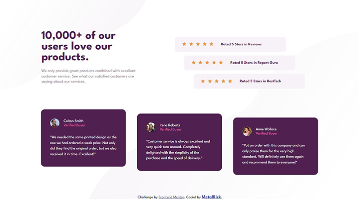

# Frontend Mentor - Social proof section solution

This is a solution to the [Social proof section challenge on Frontend Mentor](https://www.frontendmentor.io/challenges/social-proof-section-6e0qTv_bA). Frontend Mentor challenges help you improve your coding skills by building realistic projects. 

## Table of contents

- [Overview](#overview)
  - [The challenge](#the-challenge)
  - [Screenshot](#screenshot)
  - [Links](#links)
- [My process](#my-process)
  - [Built with](#built-with)
  - [What I learned](#what-i-learned)
- [Author](#author)

## Overview

### The challenge

Users should be able to:

- View the optimal layout for the section depending on their device's screen size

### Screenshot

### Links

- [Solution URL](#)
- [Live Site URL](#)

## My process

### Built with

- Flexbox
- CSS Grid

### What I learned

- Vertical **padding and margin** in percentages are relative to the **width** of the parent-element. **Top and bottom** declarations in percentages are relative to the **height** of the parent-element. [attribution](https://stackoverflow.com/questions/4982480/how-to-set-the-margin-or-padding-as-percentage-of-height-of-parent-container:)

- I need a better way to organize the stylesheet ;)

## Author

- Website - *coming soon*
- Frontend Mentor - [@MetalRick84](https://www.frontendmentor.io/profile/MetalRick84)

